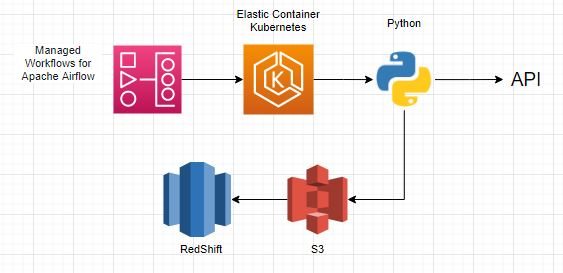

# ex3

O Managed Workflows for Apache Airflow irá orquestrar o processo de ETL do json. Assumindo aqui que seja um job em BATCH. O airflow terá uma DAG que através do [EKS Operator](https://airflow.apache.org/docs/apache-airflow-providers-amazon/stable/operators/ecs.html) irá instanciar um POD para que o processo de ETL seja realizado.

Dentro do cluster o processo será feito através da linguagem **Python**, que irá consumir a **API** pela biblioteca **requests** e passado pelo **pandas** para transformação. 

Pelo **Python** os dados transformados deverão ser persistidos no **S3**. O *JSON* bruto deve ter o objeto persistido pela chave *BRONZE/SALES/NFE/{YEAR}/{MONTH}/{DAY}/*. O dados transformado deve ser persisto no formato *parquet* pela chave *SILER/SALES/NFE/{YEAR}/{MONTH}/{DAY}/*.

Com o arquivo **parquet** disponível no **S3**, será executado um comando de **COPY** para o **RedShift**.

# Melhorias
O ideal seria que conforme as NFes forem entrando no sistema, a mesma seja disponiblizada em tempo real por um sistema de menssageria como Kafka e o consume fosse feito por um Spark ou Apache Beam também em tempo real. Acredito que o Kinesis tenha alguma função parecida, mas não conheço essa ferramenta.